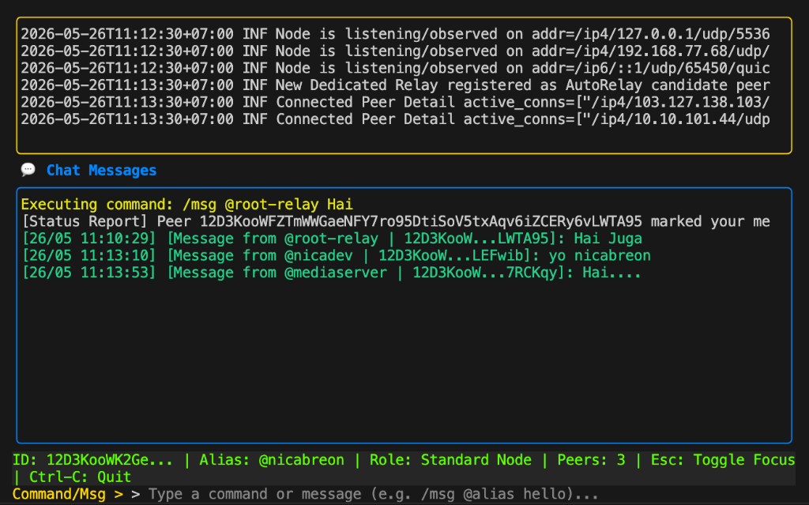

# **Meshsage: Distributed P2P Messaging Platform**

**Meshsage** is a peer-to-peer (P2P) communication platform focused on privacy, security, and network resilience. Built on top of the **libp2p** protocol, Meshsage enables secure messaging without relying on any central server, featuring industry-standard encryption and a robust offline delivery system.



---

## **🚀 Key Features**

*   **🛡️ True End-to-End Encryption (E2EE)**: 
    *   **X3DH (Extended Triple Diffie-Hellman)** for secure initial key exchange.
    *   **Double Ratchet Algorithm** (similar to the Signal Protocol) for per-message encryption with rotating keys (*Forward Secrecy*).
    *   **Skipped Keys Handling**: Ensures message decryption even if packets arrive out-of-order due to P2P network latency.

*   **📫 Offline Mailbox (Store-and-Forward)**:
    *   Messages are automatically stored on **Relay Nodes** if the recipient is offline.
    *   Automatic synchronization when a node comes back online using coordinate-based hashing.

*   **👥 Secure Group Messaging**:
    *   Encrypted group communications using the *Sender Key* mechanism.
    *   HMAC-based automatic key rotation to maintain group forward secrecy.

*   **📺 Modern Bubble Tea TUI**:
    *   Split-pane Terminal User Interface powered by **Charm Bubble Tea** and **Lipgloss**.
    *   Interactive focus switching between input and scrolling viewports.
    *   ANSI color support and log dumping.

*   **🌐 Decentralized Infrastructure**:
    *   No central authority or single point of failure.
    *   Adaptive Node Roles: Automatically transitions between **Relay** and **Client-Only** modes based on available resources.

---

## **🛠️ Prerequisites**

Ensure you have the following installed:
*   [Go](https://golang.org/doc/install) (version 1.21 or newer)
*   [Docker](https://docs.docker.com/get-docker/) & [Docker Compose](https://docs.docker.com/compose/install/)

---

## **🏃 Getting Started**

### **1. Running in TUI Mode (Recommended)**
Build the application:
```bash
go build -o meshsage ./cmd/node
```
Start in Terminal User Interface (TUI) mode:
```bash
./meshsage -tui
```

#### **TUI Keyboard Shortcuts:**
*   **`Esc`**: Toggle focus between typing commands/messages and scrolling viewports.
*   **`Tab`** (when viewports are focused): Switch scrolling active pane between the **System Log** and **Chat Messages** (indicated by a green border).
*   **`Up` / `Down` / `PgUp` / `PgDn`**: Scroll the active viewport.
*   **`Ctrl-D`**: Dump all system logs to a text file.
*   **`Ctrl-C`**: Safely shutdown the node and quit.

### **2. Using Docker (Simulated Cluster)**
Launch a simulated cluster (Alice, Bob, Charlie, and a Relay) with a single command:
```bash
docker-compose up -d --build
```

### **3. Automated E2E Testing**
We have an automated End-to-End test script that validates the Double Ratchet implementation, Offline Mailbox, and Group Messaging in various scenarios:
```bash
bash e2e_test_scenarios.sh
```
Check out the [Test Walkthrough](test_walkthrough.md) for detailed results and cryptographic verification logs.

---

## **💬 CLI/TUI Command Guide**

Once the node is running (either in CLI or TUI mode), you can use the following commands in the input field:

| Command | Description | Example |
| :--- | :--- | :--- |
| `/register @alias` | Register an alias for your Peer ID on the DHT. | `/register @nicabreon` |
| `/msg <target>` | Send an encrypted private message. Target can be a PeerID or `@alias`. | `/msg @mediaserver Hello!` |
| `/group-create <group_alias> <secure/unsecure> [member1,member2,...]` | Create a cryptographic group and register its alias (members parameter is optional). | `/group-create @kopi-senja SECURE @aldo` |
| `/group-join <group_alias>` | Join an open (UNSECURE) group. | `/group-join @woroworo` |
| `/group <group_alias_or_id> <message>` | Send an encrypted group message. | `/group @kopi-senja Halo gaes!` |
| `/group-add <group_alias_or_id> <member>` | Creator only: Add a member to a SECURE group. | `/group-add @kopi-senja @bob` |
| `/group-remove <group_alias_or_id> <member>` | Creator only: Kick a member from a group (triggers key rotation). | `/group-remove @kopi-senja @bob` |
| `/group-exit <group_alias_or_id>` | Member only: Leave a group (triggers key rotation). | `/group-exit @kopi-senja` |
| `/group-disband <group_alias_or_id>` | Creator only: Dissolve the group. | `/group-disband @kopi-senja` |
| `/group-info <group_alias_or_id>` | Display group metadata, type, and member online status. | `/group-info @kopi-senja` |
| `/fetch` | Manually trigger a mailbox fetch for offline messages. | `/fetch` |
| `/latency <target>` | Test latency (RTT) to a PeerID or `@alias`. | `/latency @mediaserver` |

---

## **🏗️ System Architecture**

For a detailed look at the subsystems, sequence flows, and network topology, see the [System Architecture & Subsystem Diagrams](architecture_diagrams.md).

*   **Networking**: libp2p (Kademlia DHT, GossipSub, mDNS).
*   **Cryptography**: X25519 (Diffie-Hellman), AES-GCM (Encryption), HMAC-SHA256 (Ratchet).
*   **Storage**: SQLite (with WAL mode for high concurrency).

---

## **📜 License**
This project is licensed under the MIT License.
