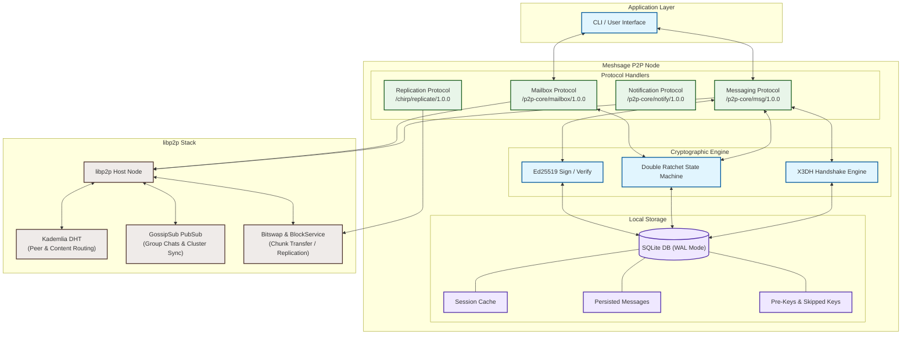
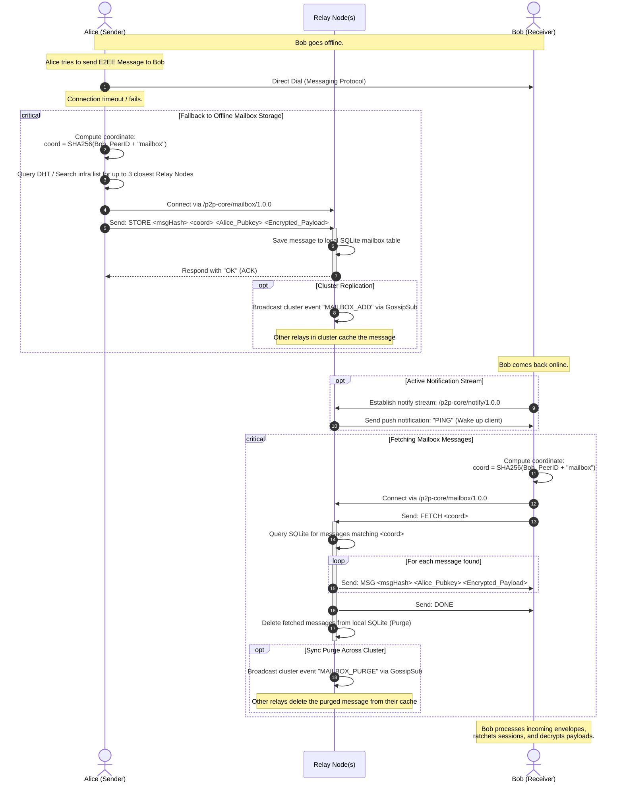
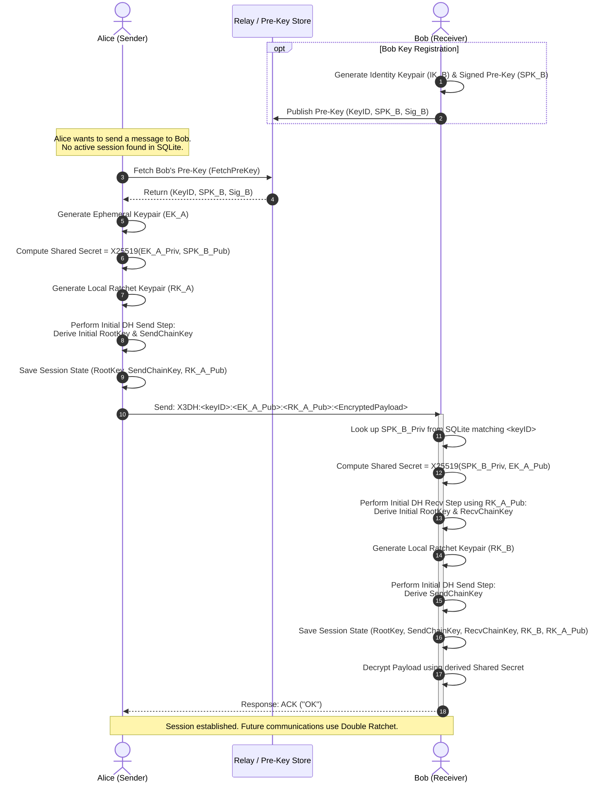
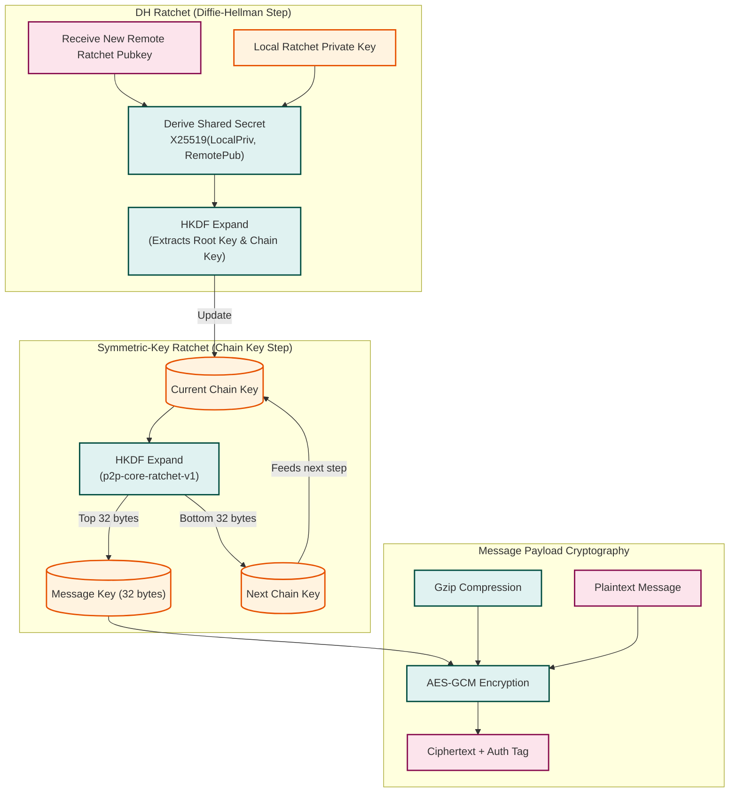
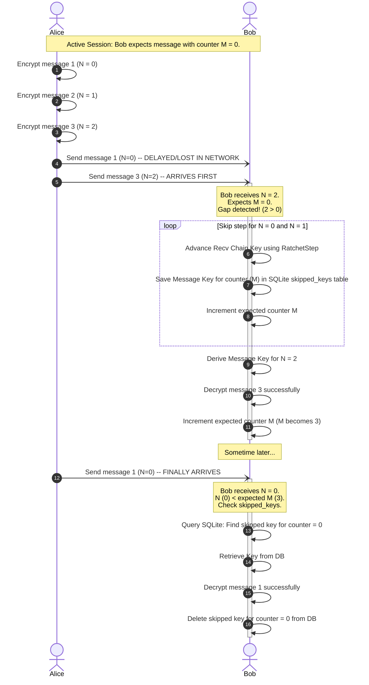
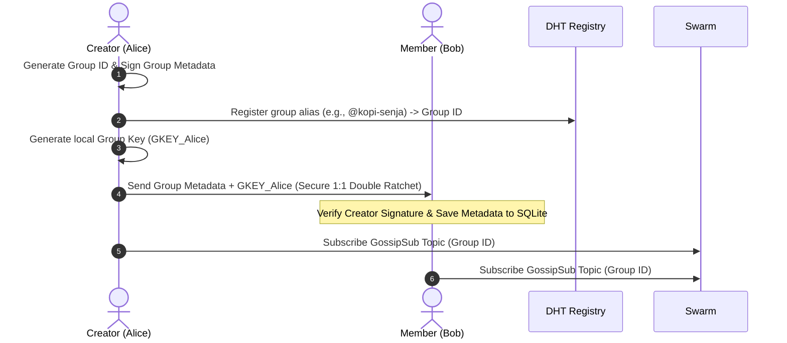
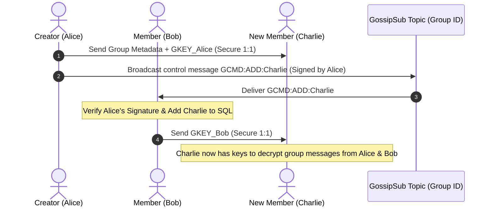
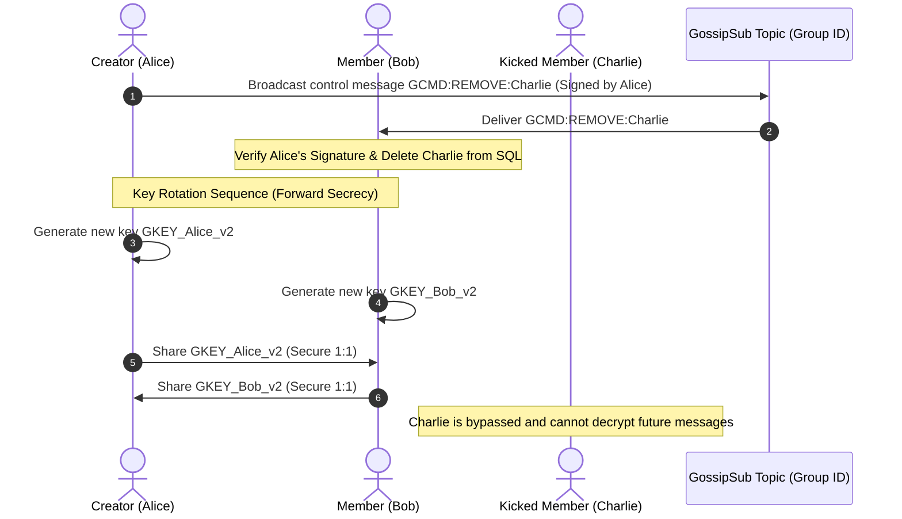
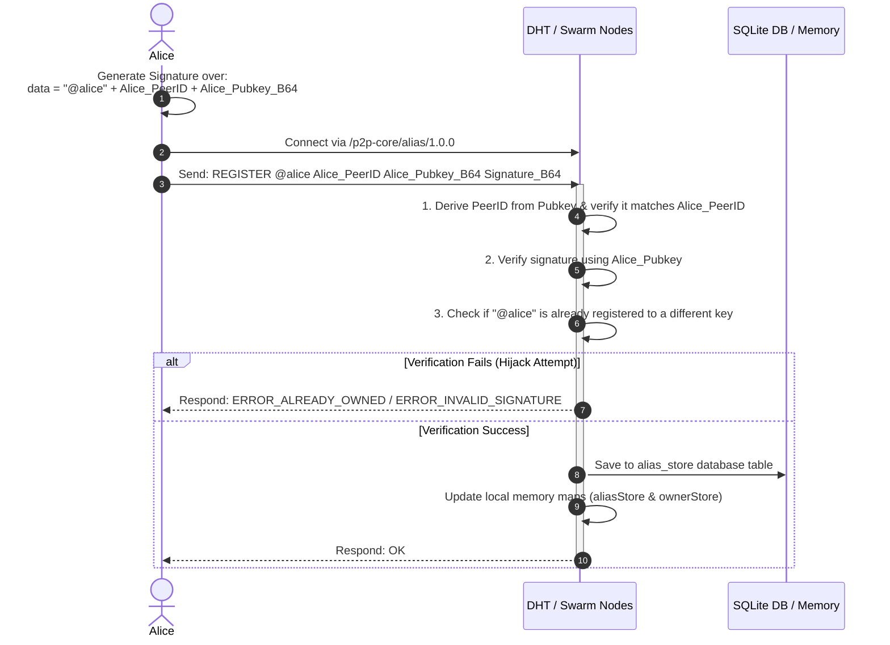
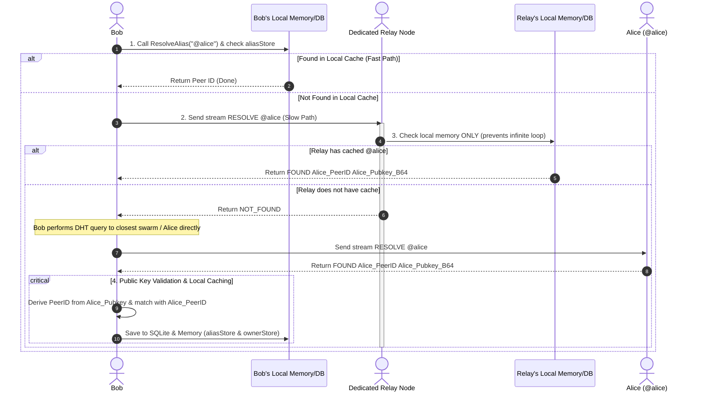

# **Meshsage: System Architecture & Subsystem Diagrams**

This document provides a detailed breakdown of the system architecture of **Meshsage**, a distributed, peer-to-peer (P2P) messaging platform. It includes high-level architectural block diagrams and detailed sequence and flow diagrams for key subsystems: the **Offline Mailbox (Store-and-Forward)**, **End-to-End Encryption (X3DH & Double Ratchet)**, and **Group Messaging (Sender Key & Fan-out)**.

---

## **1. Overall System Architecture**

Meshsage is a completely decentralized system built on the **libp2p** networking library. Every node runs a local host, handles its own state storage via SQLite, and coordinates with other nodes for routing, messaging, replication, and discovery.

### **Architectural Layers & Modules**
1. **Application Layer (CLI)**: Processes user input commands (`/msg`, `/group`, `/join`, `/fetch`, `/register`, `/latency`) and prints incoming messages, file transfer links, and status reports.
2. **Protocol Handlers**: Defined over libp2p streams. They read incoming byte streams, unpack headers, check rate limits, and dispatch payloads to the cryptographic engine or database.
3. **Cryptographic Engine**: Implements end-to-end security parameters:
   - **X3DH** for ephemeral Diffie-Hellman key exchange.
   - **Double Ratchet** to rotate message keys on every sent and received envelope.
   - **Ed25519 Signatures** for payload authenticity and non-repudiation.
4. **Local Storage (SQLite)**: Persists session states, messages, skipped keys, pre-keys, alias mappings, and group configurations. Runs in WAL (Write-Ahead Logging) mode to support safe concurrent reads/writes from background threads.
5. **libp2p Stack**: Handles multiplexing, encryption (TLS/Noise), NAT traversal, DHT routing (Kademlia), real-time broadcast pub/sub (GossipSub), and direct block transfers (Bitswap).

---

## **2. Relay Message / Mailbox Subsystem**

The Mailbox Subsystem stores messages when a peer is offline and delivers them when the peer comes online. It supports:
- **DHT Coordinate-Based Hashing**: Mailbox coordinate `coord = SHA256(PeerID + "mailbox")`.
- **Relay Redundancy**: Messages are distributed to up to 3 closest active relay/infrastructure nodes.
- **Push Notifications**: Live wake-up signals over a dedicated Notification stream.
- **Metadata Replication**: GossipSub synchronization across relay nodes for cluster state safety.

---

## **3. Encryption / Decryption Subsystem (X3DH & Double Ratchet)**

Meshsage protects 1:1 messages using a hybrid protocol combining **X3DH** (Extended Triple Diffie-Hellman) for initial session establishment and the **Double Ratchet** for continuous forward secrecy and post-compromise security.

### **A. Session Initiation & X3DH Handshake**
If Alice does not have an active session with Bob, she must perform an X3DH handshake using Bob's pre-key registered on the network.

---

### **B. Double Ratchet Message Exchange**
Once a session is established, every message is encrypted using a unique **Message Key** generated by advancing either the Symmetric Ratchet (per-message) or the DH Ratchet (when a new DH public key is received from the peer).

---

### **C. Skipped Keys Handling (Out-of-Order Delivery)**
Because P2P networks can deliver messages out of order, Meshsage keeps track of skipped chain key states. If message counter $N$ is greater than the expected counter $M$, intermediate keys are saved as **Skipped Keys** in SQLite and retrieved when the missed messages arrive.

---

## **4. Cryptographic Group Management Subsystem**

Meshsage group messaging utilizes a **Sender Key** mechanism combined with **Cryptographic Ownership Governance**. Every group is managed by a **Creator** who signs the group's metadata and controls membership (adding or removing members). 

Meshsage supports two group membership models:
1. **SECURE (Closed / Invite-Only Group)**:
   * Access is strictly creator-controlled.
   * Members are explicitly invited by the Creator via `/group-create` or `/group-add`.
   * Key distribution and membership command signatures are fully verified.
   * Forward secrecy key rotation occurs on exits (`/group-exit`) and removals (`/group-remove`).
2. **UNSECURE (Open / Public Group)**:
   * Anyone can dynamically request to join using `/group-join <alias>`.
   * The joining node resolves the group's metadata, validates the creator's metadata signature, joins the group's GossipSub topic, and broadcasts a signed `GCMD:JOIN` command.
   * All online group members receive the join request, record the new member locally, and securely share their local `GKEY`s with the new member via 1:1 secure channels.

Security guarantees:
*   **Decentralized Control**: No central server. Membership changes are validated using the Creator's digital signature.
*   **Forward Secrecy**: When a member is removed or exits, all remaining members rotate their local Group Keys (`GKEY`) and share them *only* with the remaining members, preventing the former member from decrypting future messages.
*   **Collision Isolation**: Naming collisions (groups with the same alias) are isolated cryptographically because nodes only accept and decrypt messages if they have shared keys with the sender.

### **A. Group Creation & Key Distribution**
When a group is created:
1. The Creator generates a unique `GroupID` and signs the **Group Metadata** (binding `GroupID`, `GroupAlias`, `CreatorID`, and creation timestamp).
2. The Creator registers the `GroupAlias` to the Kademlia DHT Alias Registry.
3. The Creator generates their local 32-byte group encryption key (`GKEY`) and shares the Metadata + `GKEY` with the initial member(s) over secure 1:1 channels (Double Ratchet).

---

### **B. Member Management & Key Rotation**
Only the Creator is authorized to add or remove members by broadcasting signed command envelopes (`GCMD`).

#### **Add Member (Creator Only)**
1. The Creator sends the Group Metadata and their current `GKEY` to the new member via a 1:1 secure channel.
2. The Creator broadcasts `GCMD:ADD:<new_member>` signed by the Creator to the group.
3. All existing members verify the Creator's signature, save the new member to their SQLite database, and share their own local `GKEY`s with the new member via secure 1:1 channels.

#### **Remove Member & Key Rotation (Creator Only)**
1. The Creator broadcasts `GCMD:REMOVE:<target_member>` signed by the Creator to the group.
2. All remaining members verify the Creator's signature and delete the removed member from their SQLite database.
3. To enforce **Forward Secrecy**, the Creator and all remaining members **rotate their group encryption keys (generate new random `GKEY`s)** and share them *only* with the remaining members. The removed member is excluded, losing access to all subsequent group communication.

---

## **5. Alias Registration & Resolution Subsystem**

Meshsage implements a secure, decentralized identity registry mapping human-readable usernames (e.g., `@alice`) to cryptographic `PeerID`s. This subsystem protects against hijacking through digital signatures and optimizes lookup performance using on-demand caching.

### **A. Secure Alias Registration**
To prevent alias hijacking, registering an alias requires presenting a digital signature proving ownership of the corresponding public key.

### **B. On-Demand Resolution & Cache Propagation**
Resolving an alias employs a hybrid local-first resolution search with fallback lookup cache propagation.

