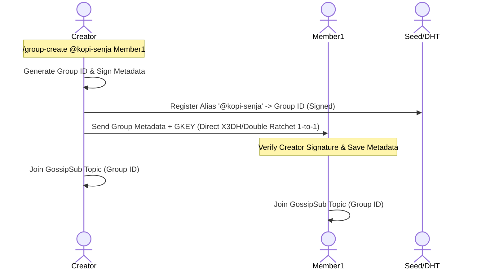
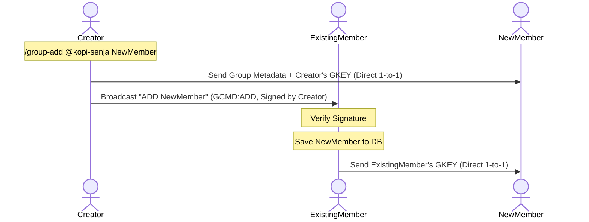

# Cryptographic Group Management Design
**Decentralized Group Chat with Kademlia DHT, GossipSub, and Double Ratchet E2EE**

This document details the architectural and cryptographic design for secure, owner-managed group chats in Meshsage.

---

## 1. Core Architecture

The group chat system is decentralized and trustless, built on top of:
1. **GossipSub (libp2p)**: Used for real-time, low-latency multicast messaging between online members.
2. **Mailbox (Store-and-Forward)**: Used to store and forward group messages for members who are currently offline.
3. **Double Ratchet (1-to-1)**: Used to securely distribute group encryption keys between members.
4. **Digital Signatures**: Used to authenticate membership change commands (ADD, REMOVE, DISBAND).

### Identity Separation
To ensure uniqueness and ease of use, group identity is split into two parts:
* **Group ID (Unique ID)**: Generated automatically upon creation. Format: `group_<hash(CreatorPeerID + Timestamp + Salt)>`. This is used as the GossipSub topic name and primary key in SQLite.
* **Group Alias**: A human-readable identifier (e.g., `@kopi-senja`). The creator registers the alias globally via the Kademlia DHT Alias Service, pointing to the Group ID. The registration requires the creator's signature, locking the alias's ownership to the creator.

---

## 2. Cryptographic Ownership & Metadata

Every group must have a **Group Metadata Document** signed by the creator. This document establishes group ownership and is distributed to all members upon joining.

### Metadata Schema (JSON)
```json
{
  "group_id": "group_8f93e2b10a9c8d...",
  "group_alias": "@kopi-senja",
  "creator_id": "12D3KooWLR1DmbvawPQoXhnFAwj53t4cg7B9GJnwWgxuvtLEFwib",
  "created_at": 1716712345,
  "signature": "MEYCIQCcR+5i7..."
}
```

### Signature Verification
The `signature` is generated by the creator signing the concatenated fields:
$$\text{Signature} = \text{Sign}_{\text{CreatorPrivateKey}}(\text{group-id} \mathbin{\Vert} \text{group-alias} \mathbin{\Vert} \text{creator-id} \mathbin{\Vert} \text{created-at})$$
All nodes verify this signature using the creator's public key (extracted from the `creator_id` PeerID).

---

## 3. SQLite Database Updates

To track ownership, member lists, and rotated keys, the SQLite database schema requires additions:

```sql
-- 1. Store Group Metadata
CREATE TABLE IF NOT EXISTS group_metadata (
    group_id TEXT PRIMARY KEY,
    group_alias TEXT UNIQUE NOT NULL,
    creator_id TEXT NOT NULL,
    created_at INTEGER NOT NULL,
    signature TEXT NOT NULL
);

-- 2. Group Members list with role identification
CREATE TABLE IF NOT EXISTS group_members_v2 (
    group_id TEXT,
    peer_id TEXT,
    role TEXT CHECK(role IN ('CREATOR', 'MEMBER')) DEFAULT 'MEMBER',
    joined_at INTEGER NOT NULL,
    PRIMARY KEY (group_id, peer_id)
);
```

---

## 4. Protocol Commands & Control Flow

Only the group creator is authorized to issue membership commands. These commands are disseminated as signed control messages.

### A. Group Creation


1. **Input**: Creator runs `/group-create <group_alias> <initial_member_peer_id_or_alias>`.
2. **Metadata Generation**: The node creates a unique `group_id`, signs the metadata, and registers the alias on the DHT.
3. **Key Initialization**: The creator generates a cryptographically secure 32-byte group encryption key (`GKEY`) and saves it locally.
4. **Invitation**: The creator transmits the metadata and `GKEY` to the initial member(s) via a direct secure 1-to-1 message (using X3DH).
5. **Subscription**: Both nodes subscribe to the GossipSub topic mapped to `group_id`.

---

### B. Add Member (Creator Only)


1. **Input**: Creator runs `/group-add <group_alias_or_id> <new_member_peer_id_or_alias>`.
2. **Direct Transmission**: The creator sends the group metadata and their own current group key to `NewMember` via a direct 1-to-1 message.
3. **Group Notification**: The creator broadcasts a signed `GCMD:ADD` message to the GossipSub topic:
   ```json
   {
     "action": "ADD",
     "group_id": "group_id",
     "target_member": "new_member_peer_id",
     "timestamp": 1716712390,
     "signature": "<creator_signature>"
   }
   ```
4. **Actions by Existing Members**:
   - Verify the signature belongs to the `creator_id`.
   - Add `new_member_peer_id` to their local SQL table.
   - Establish a 1-to-1 secure channel (Double Ratchet) with the new member and share their own group encryption keys.

---

### C. Remove Member (Creator Only)
To guarantee **Forward Secrecy** (the kicked member cannot read future messages), all remaining members must rotate their keys.

1. **Input**: Creator runs `/group-remove <group_alias_or_id> <member_peer_id_or_alias>`.
2. **Group Notification**: Creator broadcasts a signed `GCMD:REMOVE` message:
   ```json
   {
     "action": "REMOVE",
     "group_id": "group_id",
     "target_member": "removed_member_peer_id",
     "timestamp": 1716712410,
     "signature": "<creator_signature>"
   }
   ```
3. **Key Rotation & Propagation**:
   - Creator and all remaining members immediately remove the target member from their SQL database.
   - Each remaining member **generates a brand new random group encryption key (`GKEY`)**.
   - Each remaining member shares their new key **only** with the other remaining members via 1-to-1 secure messages.
   - The removed member is bypassed, cutting off their access to any new group messages.

---

### D. Exiting the Group
* **Normal Member Exit**:
  - Member broadcasts a signed `GCMD:EXIT` message.
  - Remaining members verify the signature, remove the member, and trigger the key rotation sequence (generating and sharing new keys).
* **Creator Exit (Disband Group)**:
  - Rather than transferring ownership (which creates complex trust issues), the creator exit **disbands the group**.
  - Creator broadcasts a signed `GCMD:DISBAND` message.
  - All members verify the signature, delete the group data from their database, and unsubscribe from the GossipSub topic.

---

## 5. TUI / CLI User Commands

Here is the CLI interface design for managing groups:

| Command | Allowed Actor | Description | Example |
|---|---|---|---|
| `/group-create <alias> <member>` | Any | Creates a new group with a unique ID and registers the alias. | `/group-create @kopi-senja @mediaserver` |
| `/group-add <alias_or_id> <member>` | Creator | Invites a new member and triggers group key sync. | `/group-add @kopi-senja @aldo` |
| `/group-remove <alias_or_id> <member>` | Creator | Kicks a member and triggers key rotations. | `/group-remove @kopi-senja @aldo` |
| `/group-disband <alias_or_id>` | Creator | Disbands the group and deletes it for all members. | `/group-disband @kopi-senja` |
| `/group-exit <alias_or_id>` | Member | Exits the group and triggers key rotations for others. | `/group-exit @kopi-senja` |
| `/group-info <alias_or_id>` | Member | Displays group metadata, creator, members, and online statuses. | `/group-info @kopi-senja` |
| `/group <alias_or_id> <message>` | Member | Sends an E2E encrypted message to the group. | `/group @kopi-senja Halo gaes!` |
